# **Blinkit Data Analysis**

---
## **Dataset Overview**
This project utilizes the **Blinkit Dataset**, consisting of **8523 rows** and **12 columns**.  

**Column Names:**
- Item Fat Content
- Item Identifier  
- Item Type
- Outlet Establishment Year 
- Outlet Identifier 
- Outlet Location Type 
- Outlet Size 
- Outlet Type 
- Item Visibility  
- Item Weight  
- Total Sales 
- Rating 

**KPI Used:**  
**Total Sales**, **Average Sales**, **No. of Items Sold**, and **Average Ratings**

---

## **SQL Analysis and Python Visualization**

### **Total Sales by Fat Content**
| | |
|:--:|:--:|
| 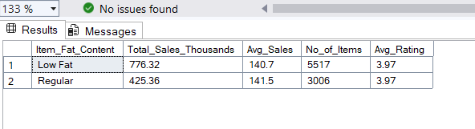 | 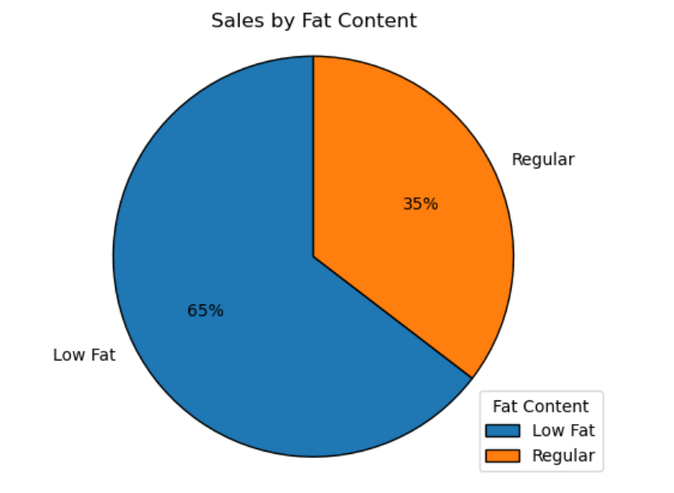 |

**Key Insight:**  
Sales of Low Fat items are higher than Regular ones — approximately **65% for Low Fat vs 35% for Regular**.

---

### **Total Sales by Item Type**
| | |
|:--:|:--:|
| 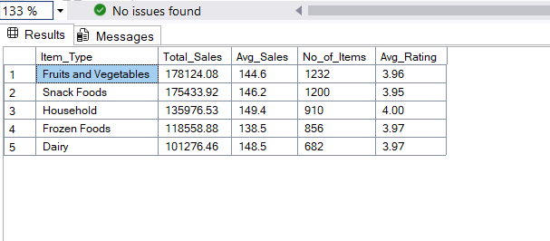 | 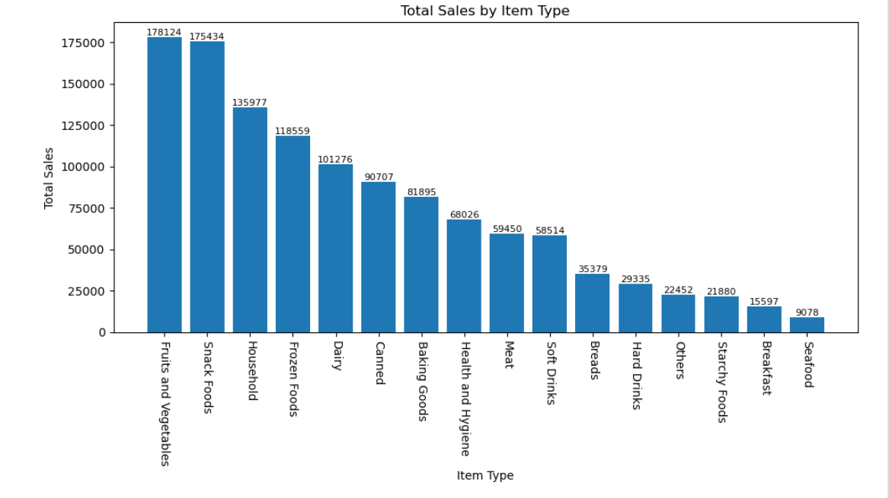 |

**Key Insight:**  
Fruits and Vegetables exhibit the highest sales performance among all Item Types.

---

### **Fat Content by Outlet for Total Sales**
| | |
|:--:|:--:|
| 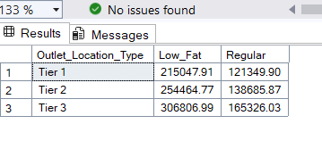 | 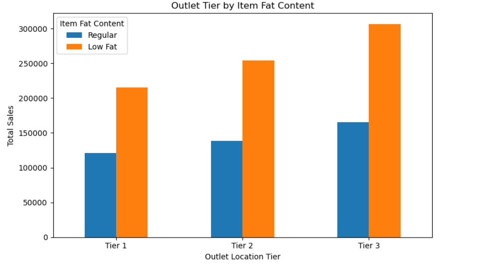 |

---

### **Total Sales by Outlet Establishment Year**
| | |
|:--:|:--:|
| 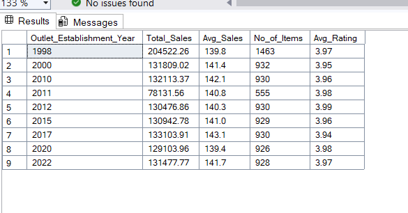 | 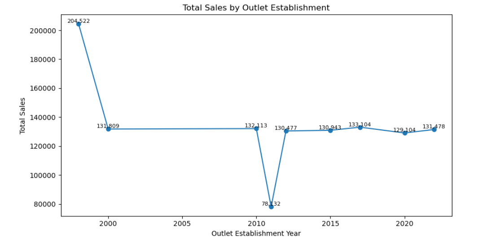 |

---

### **Sales by Outlet Size**
| | |
|:--:|:--:|
| 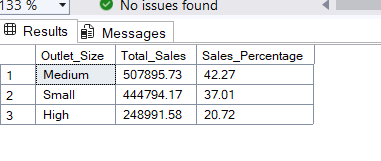 | 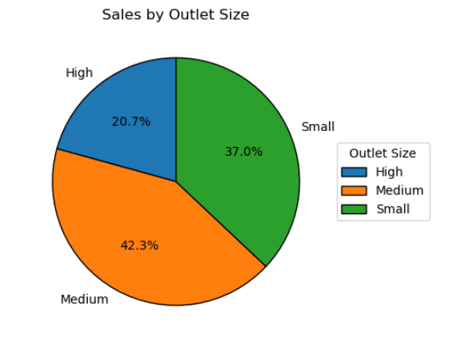 |

**Key Insight:**  
Outlets with **Medium size** demonstrate higher sales compared to both **Small** and **High** outlets.

---

### **Total Sales by Outlet Location Type**
| | |
|:--:|:--:|
| 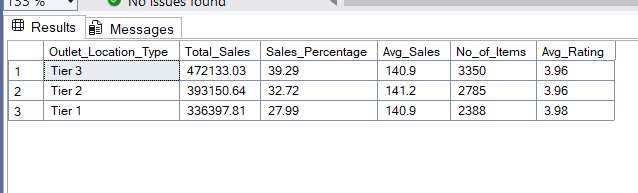 | 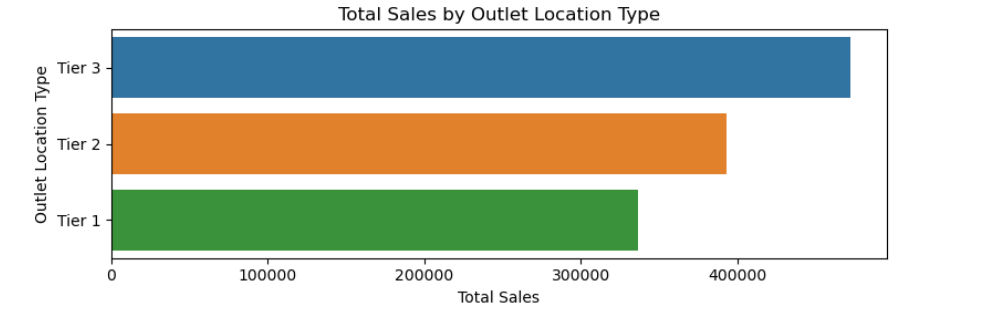 |

**Key Insight:**  
**Tier 3 outlet locations** exhibit the highest sales compared to **Tier 1** and **Tier 2** locations.

---

### **Sales Distribution Across Outlet Type & Item Type (Heatmap)**
| | 
|:--:|
| 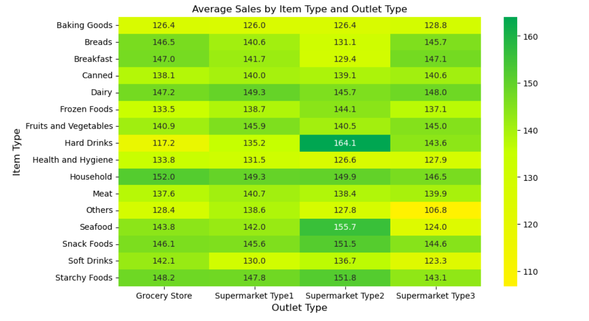 |

**Key Insight:**  
Among all item types and outlet types, **Hard Drinks in Supermarket Type 2** outlets record the **highest average sales**.

---

## **Power BI Dashboard**
| |
|:--:|
| 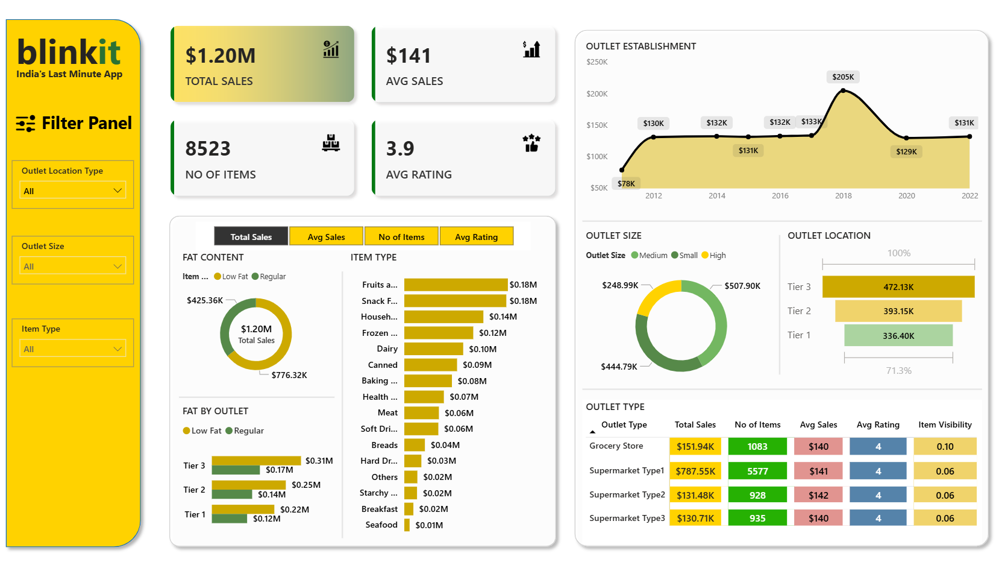 |

---

## **Author**

**Ashutosh Sahoo**  
**Computer Science and Engineering**  
**Specialization:** Data Science and Analytics | IIIT Nagpur  
**Email:** [sahooashutosh792@gmail.com](mailto:sahooashutosh792@gmail.com)
